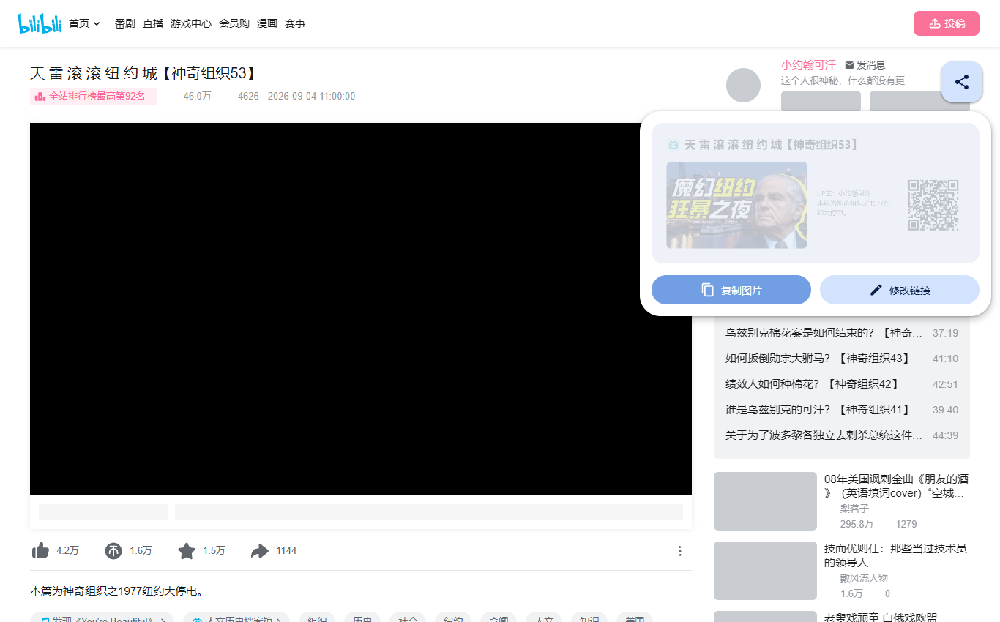
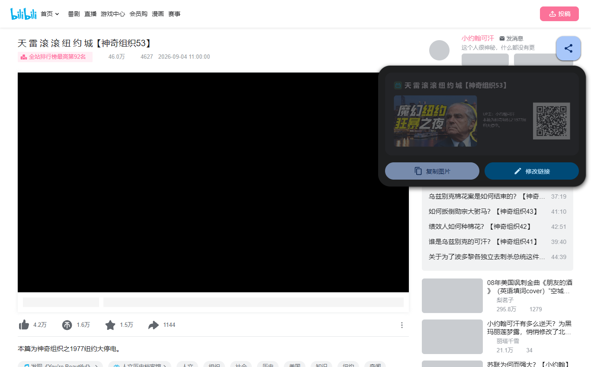
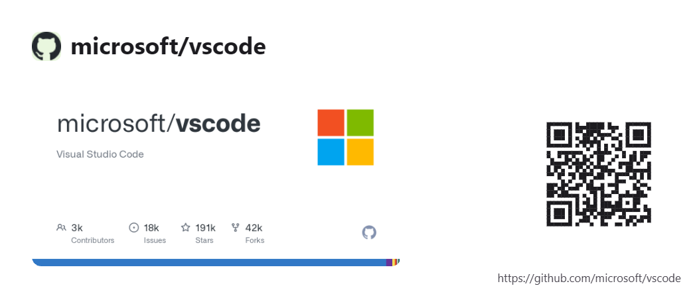
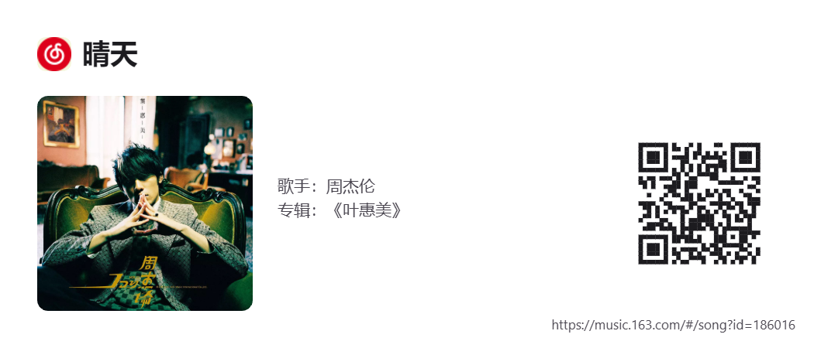

# SimpShare — 浏览器扩展

在网页里生成 21:9 分享卡片的 Chrome / Edge 扩展（Manifest V3，要求 Chrome 111+）。
点开页面上的分享按钮，卡片就地生成：站点图标、标题、封面、简介、链接二维码，
复制后直接贴给别人。界面和卡片都跟随系统的深色 / 浅色模式。

SimpShare 还有 [Android 版](https://github.com/nekoslio/SimpShare/tree/android)：
在任意应用里点"分享"选 SimpShare，生成同款卡片。两端共用一份规则文件。


B 站链接会按内置规则改写成镜像域名（`bilibili.com/video/BV…` →
`bilibilibb.com/video/BV…`），短链 `b23.tv` 同理，卡片上的链接标注和二维码
跟着一起改，编辑器的链接框会显示"已改写"标记；抓标题封面仍用原始链接。

GitHub 仓库页的封面用官方社交卡片，不裁切、在封面区水平居中；og 图缺失或
抓取失败时自动改用 `opengraph.githubassets.com` 现生成的卡片图。

## 安装

从 [Releases](https://github.com/nekoslio/SimpShare/releases) 下载
`simpshare-1.0.4.zip` 并解压，打开 `chrome://extensions`（Edge 是
`edge://extensions`），打开右上角**开发者模式**，点**加载已解压的扩展程序**，
选中解压出的文件夹，最后固定到工具栏。

`simpshare-1.0.4.crx` 是带签名的打包产物，供企业策略部署使用。新版 Chrome
不允许直接拖入安装非商店扩展，拖入会报 `CRX_REQUIRED_PROOF_MISSING`，
这是浏览器限制，不是包坏了。

## 使用

页面右侧有一个悬浮分享按钮。按住可以拖动，贴到屏幕左右边缘会吸附成一条窄边，
悬停展开、点击还原，位置会被记住。点按钮打开面板：

- **复制图片**：按 2100×900 高清重新渲染并写入剪贴板（预览是 1050×450）
- **修改链接**：填一个新链接回车，按新链接重新抓取生成

| 浅色 | 深色 |
| --- | --- |
|  |  |

## 卡片长什么样

规则内站点出内容封面，右下角是链接二维码：

| GitHub 仓库 | 网易云音乐 |
| --- | --- |
|  |  |

不在规则内的站点自动读页面 meta：取到 `og:image` 就拿它当封面（比如 arXiv），
取不到就整体退回二维码模式，标题简介照常，卡片不会破版。


几个绘制细节：GitHub 的官方社交卡片自带文字，所以不裁封面、不另绘简介；
URL 标注锚定在卡片右下角，链接长到会挤压其他元素时改显示"URL 过长，请扫描二维码"；
二维码纠错级别 M，四周留 4 模块静区。

## 站点适配

内置 41 条站点规则（`rules.json` v6）。重点站点走精确提取：

- **bilibili 视频**：读页面内嵌状态 `__INITIAL_STATE__.videoData`，拿标题、UP主、简介、原始封面
- **bilibili 专栏 / 动态图文**：专栏页是纯客户端渲染的壳，走开放 API `x/article/view` 拿标题、UP主、头图与摘要；
  动态图文（opus）读页面内嵌 `__INITIAL_STATE__.detail`，取正文文本、UP主与首个图片节点
- **网易云音乐**：走同源 Web API `/api/song/detail`，拿歌名、歌手、专辑、封面（专辑页、歌单页也支持）
- **GitHub**：og 元信息，标题取 `owner/repo`，简介去掉样板句
- **百度网盘分享**：带提取码的链接在页面内自动验证并跳到文件列表页，标题即文件名（去"免费高速下载"后缀）
- **DuckDuckGo 搜索**：搜索页没有 og，标题直接从 `q` 参数组装
- **123云盘**：分享页 `<title>` 服务端直出文件名，规则负责去掉站点后缀

其余规则内站点读 og 元信息。逐站用真实浏览器复核过：YouTube、腾讯视频、优酷、
Vimeo、Spotify、微信公众号文章、知乎专栏、豆瓣、掘金、CSDN、少数派、GitLab、npm、
Stack Overflow、Steam、维基百科等都能正常出封面，豆瓣的图片防盗链由后台携带来源页
Referer 解决。知乎问答、V2EX、B 站直播不提供 `og:image`，爱奇艺、QQ音乐是纯客户端渲染
拿不到 og，这些站点会自动降级二维码模式；微博、小红书、抖音有登录墙，未登录时
大概率降级，登录后正常。

客户端渲染与强跳转站点走"无头捕获"：规则声明 `render: true` 后，"修改链接"提交的
链接由后台开一个隐藏标签页交给真实浏览器加载——HTTP 302、JS 跳转、SPA 渲染全部完成、
标题与 og 稳定后才从页面里取元信息，随后标签页立即关闭。**小米社区**（帖子标题渲染
后才出现，`coverFromDom` 取帖子配图当封面）、**闲鱼**（`p.goofish.com` 短链经 302 落到
h5 端再 JS 跳转 www 端；商品详情接口有登录门禁，登录态下标题即商品名、`coverFromDom`
取商品首图当封面，未登录自动降级二维码模式）、**百度网盘**（带提取码的链接在页面内
自动验证跳列表页后标题才是文件名，`minMs` 保证不早收）、**123云盘** 按此处理。

**酷安**网页端对不带追踪参数的链接只渲染"扫码查看"落地页；从酷安 App 分享出的链接
带 `?s=shareToken`，服务端会渲染完整页面——`coverFromHtml` 从页面 HTML 里抠帖子首图
当封面，裸链接降级二维码模式。Android 端分享进入时还会用分享文本里的【标题】与
"分享xxx的图文"前缀做标题/简介兜底（`?s=` token 过期时也有效）。

降级不是坏掉：封面拿不到就换成二维码模式，功能照常。

## 规则订阅文件

规则全部声明在 `src/rules/rules.json`，GKD 风格的声明式 JSON，由 `src/lib/rules.js`
的通用解释器执行——加站点、改提取逻辑只需要改这份文件，不用碰 JS：

```jsonc
{
  "siteRules": [
    {
      "id": "bilibili-video",
      "matchAny": [                                  // 多个匹配分支：hosts 后缀 + path 正则
        { "hosts": ["bilibili.com"], "path": "/video/" },
        { "hosts": ["b23.tv"] }
      ],
      "extract": {
        "og": true,                                  // head <meta> 兜底
        "state": {                                   // 页面全局状态声明式提取
          "source": "__INITIAL_STATE__",
          "requirePath": "videoData.title",
          "fields": {
            "title": "{videoData.title}",
            "cover": "{videoData.pic}",
            "descLines": ["UP主：{videoData.owner.name}", "{videoData.desc}"]
          }
        }
      },
      "transforms": [{ "field": "cover", "forceHttps": true }]
    }
  ]
}
```

| 字段 | 作用 |
| --- | --- |
| `match` / `matchAny` | hosts（后缀匹配）+ `path` 正则 + `pathExclude` + `query` 参数；`pathSource: "pathAndHash"` 兼容 `#/song?id=` 这类哈希路由 |
| `extract.og` | head `<meta>` 元信息兜底（og: → twitter: → itemprop） |
| `extract.state` | 页面全局对象按 JSON 路径取值：`a.b.0.c`、`thumbnails[-1]`（末元素）、`artists[*].name`（通配收集） |
| 模板 | `{路径}` 取值，修饰符 `|join '分隔符'`、`|fallback 路径`、`|clip 160`、`|first`（取数组首元素）；取不到值的占位行整行丢弃 |
| `extract.api` | 声明式 Web API：URL 模板 `{id}` + 多分支 `whenPath` + JSON 路径字段映射；`idFrom` 支持 `queryOrHash` 和 `path`（按正则捕获组从路径取 id，如 B 站专栏 `/read/cv(\d+)`） |
| `render` | `true` 或 `{ "minMs": 9000 }`：客户端渲染/强跳转站点改由无头捕获——后台开隐藏标签页交给真实浏览器加载，HTTP 302、JS 跳转、SPA 渲染全部完成且标题/og 稳定后再取元信息（`minMs` 为最短等待，兜底百度网盘"验证提取码 → 跳列表页"这类慢跳转）；Android 端用无头 WebView 实现同一语义 |
| `transforms` | `stripRegex`、`forceHttps`、`appendQuery`；`titleFromPath` 从 URL 捕获组组装标题，`titleFromQuery` 从 query 参数组装标题（如 DuckDuckGo 的 `q`） |
| `card` | 传给渲染器：`containCover`（封面不裁切）、`hideDesc`（不绘制简介） |
| `redirect.rules` | 链接改写：`match`/`replace` 把卡片与二维码上的 URL 改写为镜像域名，`unmatch`/`unreplace` 在"修改链接"提交时反向还原成源站 URL 再匹配规则 |

未适配站点也可以出卡片：`behavior.ogForUnmatchedSites: true` 时读 head meta，
取到封面用封面模式，取不到退二维码模式。

## 项目结构

```
manifest.json                     MV3 清单（content scripts 分 ISOLATED / MAIN 两个 world）
src/rules/rules.json              站点规则订阅文件（与应用主体分离，可独立更新）
src/lib/qrcode.js                 二维码生成器（qrcode-generator 1.4.4，MIT）
src/lib/rules.js                  规则解释器（匹配 / JSON 路径 / 模板 / 变换，无站点硬编码）
src/lib/render.js                 分享卡片 Canvas 渲染器（2100×900 设计稿，浅色/深色双主题）
src/content/main-world.js         MAIN world 通用状态桥（按规则声明的路径取页面全局状态）
src/content/content.js            UI（FAB / 吸附条 / 面板 / snackbar）+ 提取编排 + 复制流程
src/background/service-worker.js  图片抓取转 dataURL（带 Referer）、跨页提取、剪贴板兜底
src/background/offscreen.*        offscreen document 剪贴板兜底
src/assets/icons/                 扩展图标（node tools/make-icons.js 生成）
```

UI 隔离在 Shadow DOM 里（adoptedStyleSheets 注入 M3 令牌），不受页面样式影响；
封面和 favicon 由后台抓取转 dataURL，画布不被跨域污染；剪贴板先走内容脚本
`navigator.clipboard.write`，失败自动转 offscreen document；"修改链接"由后台按
同一份 rules.json 完成抓取与提取。

## 本地测试与工具

```bash
node tools/make-icons.js             # 重新生成扩展图标
node tools/serve.js                  # 启动本地测试页 http://127.0.0.1:8123/test/page.html
node tools/review-sites.js           # 批量复核规则内站点（og 提取 + 封面直链下载）
node tools/rules-smoke.js            # 规则解释器自检（匹配 / API 提取 / 状态提取 / 变换）
node tools/e2e/run.js [url]          # 端到端：开面板、预览、拖拽吸附、恢复
node tools/e2e/export-live.js <url>  # 导出真实扩展链路生成的卡片（SIMPSHARE_THEME=dark 深色）
node tools/e2e/edit-link.js          # 端到端：修改链接、跨页提取、重新生成
node tools/e2e/verify-urls.js <url…> # 批量验证：修改链接 → 后台提取（含 render 无头捕获）→ 导出卡片
```

测试页含 5 种卡片样例、二维码 jsQR 回读自检与 33 条站点规则匹配自检；运行产物输出到
`test/out/`（本地生成，不入库）。`tools/e2e/chrome/` 是 Chrome for Testing 136
（约 150MB；Chrome 137+ 的 headless 不再支持 `--load-extension`，所以固定这个版本），
不需要可以直接删掉。README 里的截图就是用 `export-live.js` 和 `run.js` 在真实页面上
生成的。

## 已知限制

- 微博 / 小红书 / 抖音这类强登录站点，未登录时 og 信息可能缺失（自动降级二维码模式）
- `render: true` 站点的"修改链接"提取会短暂开一个后台标签页交给真实浏览器加载，捕获完成立即关闭
- 部分站点的 favicon 受防盗链影响时会回退为站点首字母色块
- `chrome://` 等浏览器内部页面无法注入内容脚本
- 剪贴板需要页面处于聚焦状态；极少数严格 CSP 页面会自动走 offscreen 兜底通道

## 隐私

不收集、不上传任何数据。所有抓取都发生在生成分享图的那一瞬间，只读取公开的
页面元信息和封面图。

## 协议

[MIT](LICENSE)。内含的二维码生成库
[qrcode-generator](https://github.com/kazuhikoarase/qrcode-generator)
（`src/lib/qrcode.js`）同为 MIT，版权归其作者 Kazuhiko Arase 所有。
